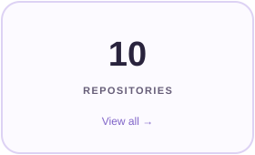
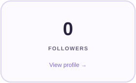
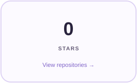
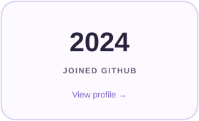
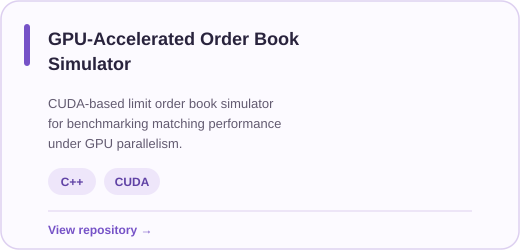
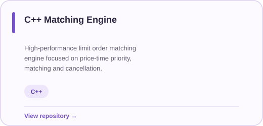
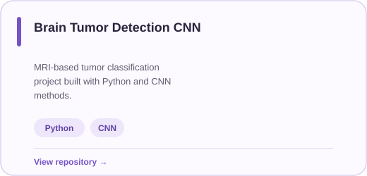
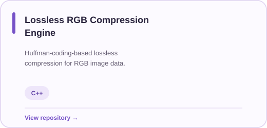
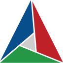

<h1>ASTHA BANSAL</h1>

<h3>Computer Science · AI & Data Science</h3>

  Building systems, exploring machine learning, 
  solving problems, and contributing to open source.

# ASTHA BANSAL

### Computer Science · AI & Data Science

**JECRC University · Jaipur · B.Tech CSE · 2024–2028**

Computer Science student exploring systems, machine learning,
competitive programming, and open source.

 

<a href="https://github.com/true-brace05">GitHub</a>
&nbsp;&nbsp;·&nbsp;&nbsp;
<a href="https://www.linkedin.com/in/astha-bansal05/">LinkedIn</a>
&nbsp;&nbsp;·&nbsp;&nbsp;
<a href="https://codeforces.com/profile/Truebrace05">Codeforces</a>
&nbsp;&nbsp;·&nbsp;&nbsp;
<a href="https://huggingface.co/divisivefallacy">Hugging Face</a>
&nbsp;&nbsp;·&nbsp;&nbsp;
<a href="asthabansal1705@gmail.com">Email</a>

 

## GITHUB

<table>
<tr>

<td>

</td>

<td>

</td>

<td>

</td>

<td>

</td>

</tr>
</table>

## FEATURED PROJECTS

<table>
<tr>

<td width="50%" valign="top">

</td>

<td width="50%" valign="top">

</td>

</tr>

<tr>

<td width="50%" valign="top">

</td>

<td width="50%" valign="top">

</td>

</tr>
</table>

## TECH STACK

  

<b>LANGUAGES</b>
&nbsp;&nbsp;&nbsp;&nbsp;&nbsp;&nbsp;
<b>DATA &amp; ML</b>
&nbsp;&nbsp;&nbsp;&nbsp;&nbsp;&nbsp;
<b>TOOLS &amp; TECHNOLOGIES</b>

  

&nbsp;&nbsp;

&nbsp;&nbsp;

&nbsp;&nbsp;

&nbsp;&nbsp;&nbsp;&nbsp;&nbsp;&nbsp;&nbsp;&nbsp;

&nbsp;&nbsp;

&nbsp;&nbsp;

&nbsp;&nbsp;

&nbsp;&nbsp;&nbsp;&nbsp;&nbsp;&nbsp;&nbsp;&nbsp;

&nbsp;&nbsp;

&nbsp;&nbsp;

&nbsp;&nbsp;

&nbsp;&nbsp;

## OPEN SOURCE JOURNEY

<table>
<tr>

<td width="18%" align="center" valign="middle">

</td>

<td width="82%" align="left" valign="middle">

<h3>Learning by contributing</h3>

Learning how to work with real-world codebases — starting with issues
I can understand end-to-end, learning from maintainers, and gradually
taking on larger contributions.

 

</td>

</tr>
</table>

## LET'S CONNECT

&nbsp;&nbsp;&nbsp;&nbsp;&nbsp;&nbsp;

&nbsp;&nbsp;&nbsp;&nbsp;&nbsp;&nbsp;

&nbsp;&nbsp;&nbsp;&nbsp;&nbsp;&nbsp;

&nbsp;&nbsp;&nbsp;&nbsp;&nbsp;&nbsp;

