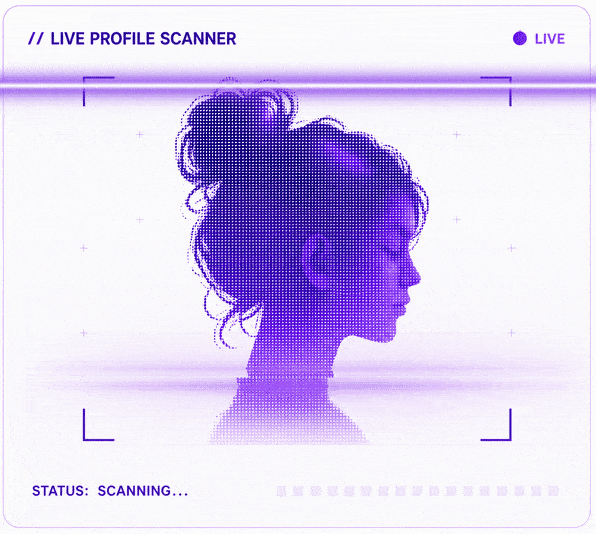

<table border="0" cellspacing="0" cellpadding="0">
<tr>
<td width="52%" valign="middle">

<h1>ASTHA BANSAL</h1>

  

Third-year Computer Science student specializing in AI & Data Science,
interested in systems, machine learning, and competitive programming.
I enjoy building from first principles, solving challenging problems,
and exploring how software works under the hood. Currently diving deeper
into PyTorch, high-performance systems, and open source.

 

&nbsp;
&nbsp;
&nbsp;
&nbsp;

</td>

<td width="48%" align="center" valign="middle">

</td>
</tr>
</table>

## GITHUB

<table>
<tr>

<td>

</td>

<td>

</td>

<td>

</td>

<td>

</td>

</tr>
</table>

## FEATURED PROJECTS

<table>
<tr>

<td width="50%" valign="top">

</td>

<td width="50%" valign="top">

</td>

</tr>

<tr>

<td width="50%" valign="top">

</td>

<td width="50%" valign="top">

</td>

</tr>
</table>

<table border="0" cellpadding="0" cellspacing="0" width="100%">
<tr>

<td width="50%" valign="top">

&nbsp;&nbsp;
<strong>TECH STACK</strong>

### LANGUAGES

&nbsp;&nbsp;&nbsp;

&nbsp;&nbsp;&nbsp;

&nbsp;&nbsp;&nbsp;

---

### TOOLS & TECHNOLOGIES

&nbsp;&nbsp;&nbsp;

&nbsp;&nbsp;&nbsp;

&nbsp;&nbsp;&nbsp;

&nbsp;&nbsp;&nbsp;

---

### DATA & ML

&nbsp;&nbsp;&nbsp;

&nbsp;&nbsp;&nbsp;

&nbsp;&nbsp;&nbsp;

</td>

<td width="50%" valign="top">

&nbsp;&nbsp;
<strong>OPEN SOURCE</strong>

### GITHUB CONTRIBUTIONS

 

<strong>❝ Always learning. Always building. ❞</strong>

  

</td>

</tr>
</table>

## LET'S CONNECT

&nbsp;&nbsp;&nbsp;&nbsp;&nbsp;&nbsp;

&nbsp;&nbsp;&nbsp;&nbsp;&nbsp;&nbsp;

&nbsp;&nbsp;&nbsp;&nbsp;&nbsp;&nbsp;

&nbsp;&nbsp;&nbsp;&nbsp;&nbsp;&nbsp;

