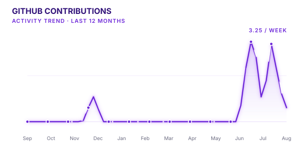

<picture>
  <source
    media="(prefers-color-scheme: dark)"
    srcset="assets/banner-dark.png">
  <source
    media="(prefers-color-scheme: light)"
    srcset="assets/banner-light.png">
  
</picture>

 

# ASTHA BANSAL

### Computer Science · AI & Data Science

**JECRC University · Jaipur · B.Tech CSE · 2024–2028**

Computer Science student exploring systems, machine learning,
competitive programming, and open source.

 

<a href="https://github.com/true-brace05">GitHub</a>
&nbsp;&nbsp;·&nbsp;&nbsp;
<a href="https://www.linkedin.com/in/astha-bansal05/">LinkedIn</a>
&nbsp;&nbsp;·&nbsp;&nbsp;
<a href="https://codeforces.com/profile/Truebrace05">Codeforces</a>
&nbsp;&nbsp;·&nbsp;&nbsp;
<a href="https://huggingface.co/divisivefallacy">Hugging Face</a>
&nbsp;&nbsp;·&nbsp;&nbsp;
<a href="asthabansal1705@gmail.com">Email</a>

 

---

## GITHUB

<table>
<tr>

<td>

</td>

<td>

</td>

<td>

</td>

<td>

</td>

</tr>
</table>

---

## FEATURED PROJECTS

<table>
<tr>

<td width="50%" valign="top">

</td>

<td width="50%" valign="top">

</td>

</tr>

<tr>

<td width="50%" valign="top">

</td>

<td width="50%" valign="top">

</td>

</tr>
</table>

--- 

## TECH STACK

<table>
<tr>

<td width="33%" valign="top" align="center">

<h3>Languages</h3>

<table align="center">
<tr>
<td width="38" align="center">

</td>
<td align="left"><b>C++</b></td>
</tr>

<tr>
<td align="center">

</td>
<td align="left"><b>Python</b></td>
</tr>

<tr>
<td align="center">

</td>
<td align="left"><b>C</b></td>
</tr>

<tr>
<td align="center">

</td>
<td align="left"><b>CUDA</b></td>
</tr>
</table>

</td>

<td width="33%" valign="top" align="center">

<h3>Tools &amp; Technologies</h3>

<table align="center">
<tr>
<td width="38" align="center">

</td>
<td align="left"><b>Git</b></td>
</tr>

<tr>
<td align="center">

</td>
<td align="left"><b>Linux</b></td>
</tr>

<tr>
<td align="center">

</td>
<td align="left"><b>CMake</b></td>
</tr>

<tr>
<td align="center">

</td>
<td align="left"><b>MySQL</b></td>
</tr>

<tr>
<td align="center">

</td>
<td align="left"><b>VS Code</b></td>
</tr>
</table>

</td>

<td width="33%" valign="top" align="center">

<h3>Currently Learning</h3>

<table align="center">
<tr>
<td width="38" align="center">

</td>
<td align="left"><b>PyTorch</b></td>
</tr>

<tr>
<td align="center">

</td>
<td align="left"><b>Open Source Development</b></td>
</tr>
</table>

</td>

</tr>
</table>

---

## GITHUB ACTIVITY

---

## OPEN SOURCE JOURNEY

<table>
<tr>

<td width="18%" align="center" valign="middle">

</td>

<td width="82%" align="left" valign="middle">

<h3>Learning by contributing</h3>

Learning how to work with real-world codebases — starting with issues
I can understand end-to-end, learning from maintainers, and gradually
taking on larger contributions.

 

</td>

</tr>
</table>

---

## LET'S CONNECT

  

&nbsp;&nbsp;&nbsp;&nbsp;&nbsp;

&nbsp;&nbsp;&nbsp;&nbsp;&nbsp;

&nbsp;&nbsp;&nbsp;&nbsp;&nbsp;

&nbsp;&nbsp;&nbsp;&nbsp;&nbsp;

